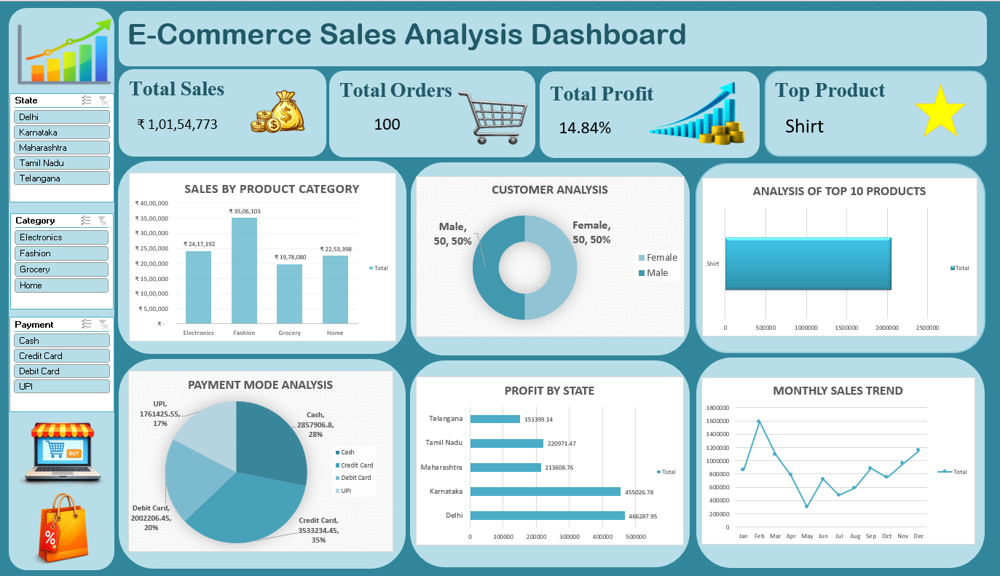

# Ecommerce-Sales-Analysis

## Project Overview
This project analyzes e-commerce sales data using Microsoft Excel to identify sales trends, profit performance, and key business insights.

## Tools Used
- Microsoft Excel
- Pivot Tables
- Pivot Charts
- Slicers
- Excel Dashboard

## Key Features
- Data analysis and cleaning
- Sales and profit analysis
- KPI tracking
- Interactive dashboard
- Pivot table and chart analysis

## Project Dashboard

The project includes an interactive Excel dashboard for analyzing sales and profit performance.

## File
The complete Excel project file is available in this repository.
